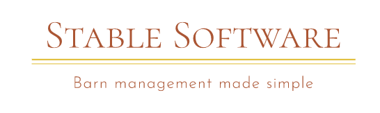

# 🐴 Stable Software

This app is focused on helping barn managers keep track of their daily scheduales, horses and rider rosters.
A barn manager will be able to keep track of a varitety of stats on each horse and see what stall number a horse is being kept in for easy, seemless management.
A manager may also log in and access to the scheduales page where they can see whcih horse needs to be riden that day and at what time.

## User Stories

#### Welcome/Sign Up

- As a new user
- I want to get a good understanding of what the app can do/track for me
- I want to be able to log in or sign up

#### Login Page

- As a user/barn manager
- I want to be able to enter my login info
- I want to be able to access my account with the nav to head to scheduale/horse/rider roster

#### Horses

- As a user
- I want to be able to add a horse to my roster with stats including name, age, breed, showname, and stall number.
- I want to be able to sort horses by each property above for seemless access.

#### Rider

- As a user
- I want to be able to see all riders displayed
- I want to be able to select a rider and see what horse they are assigned to care for and ride on which days and times.

#### Schedule

- As a user
- I want select a day of the week and see a filtered list of horses that need to ne ridden and at what time
- I want to be able to click that horses name and get stats to know where to find the horse and to know what equipment to use
